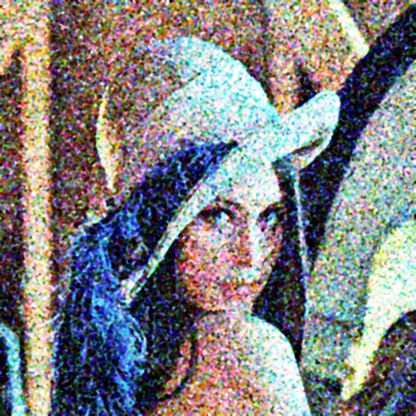
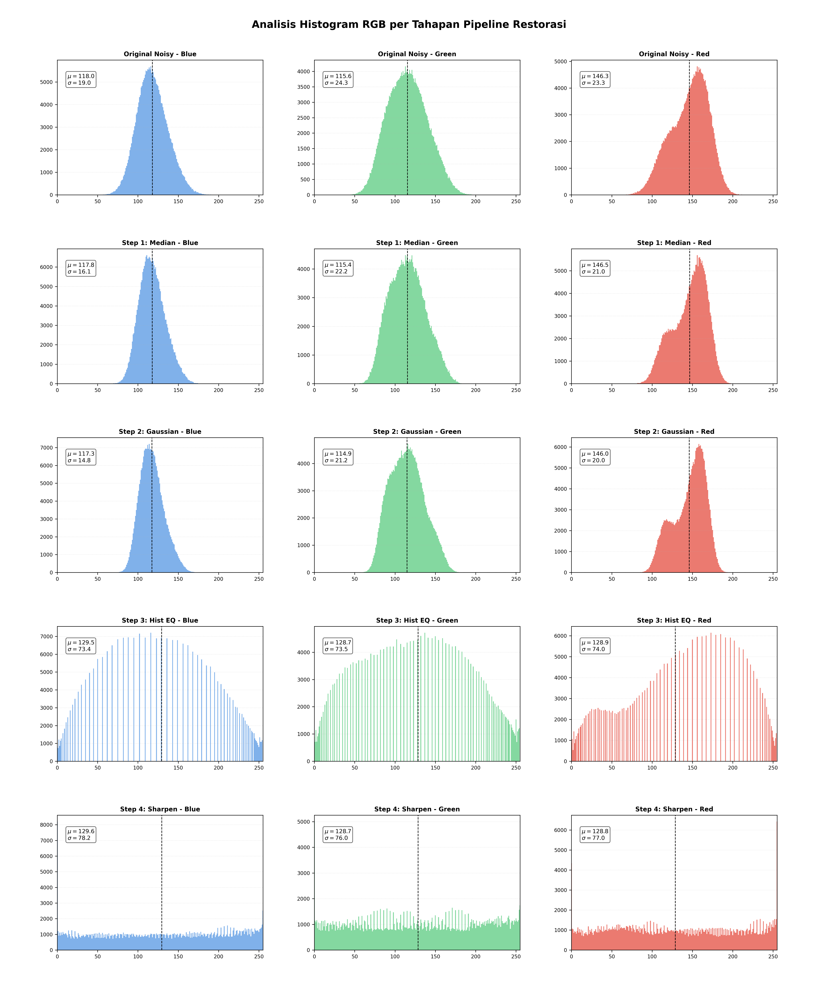

# Mini Project 1 [Image Restoration]
**Mata Kuliah:** Pengolahan Citra dan Video

---

## Identitas Mahasiswa
- **Nama :** Lu'bah Al 'Aini
- **NRP :** 5024241082

---

## Daftar Isi
1. [Rumusan Masalah](#1-rumusan-masalah)
2. [Struktur Project](#2-struktur-project)
3. [Hasil Restorasi dan Analisis Visual](#3-hasil-restorasi-dan-analisis-visual)
4. [Landasan Teoritis](#4-landasan-teoritis)
5. [Hasil dan Analisis](#5-hasil-dan-analisis)
6. [Cara Menjalankan Program](#6-cara-menjalankan-program)

---

## 1. Rumusan Masalah
Citra masukan (Lena) dalam project ini mengalami degradasi kompleks yang terdiri dari empat jenis gangguan simultan:
- **Salt-and-Pepper Noise:** Gangguan piksel ekstrem (hitam/putih) yang sangat padat.
- **Gaussian Noise:** Derau acak berdistribusi normal yang mengaburkan tekstur asli.
- **Low Contrast:** Distribusi intensitas cahaya yang sempit, menyebabkan citra terlihat kusam.
- **Blurring:** Hilangnya detail frekuensi tinggi pada bagian tepi akibat proses degradasi.

Tujuan project ini adalah merestorasi citra agar kembali bersih, tajam, dan memiliki kontras yang baik menggunakan implementasi manual tanpa fungsi instan OpenCV.

---

## 2. Struktur Project
Project ini tersusun dengan struktur sebagai berikut:

```text
mp1-image-restoration/
├── restoration.py         # Source code utama (Pipeline & Visualisasi)
├── README.md              # Dokumentasi lengkap proyek
├── input/
│   └── lena_noisy.png     # Citra masukan yang rusak
└── output/                # Folder hasil (Dihasilkan otomatis)
    ├── lena_restored.png            # Hasil akhir restorasi
    ├── histogram_step_by_step.png   # Grafik statistik histogram 5x3
    └── visual_step_by_step.png      # Dokumentasi visual per tahapan
```
---

## 3. Hasil Restorasi dan Analisis Visual

### Perbandingan Akhir
| Citra Input (Noisy) | Citra Output (Restored) |
| :---: | :---: |
|  |  |

---

### Analisis Perubahan per Tahap
Berikut adalah visualisasi transformasi citra pada setiap langkah pipeline:


| Tahapan | Teknik (Manual) | Status Noise & Kontras | Analisis Visual & Detail |
| :--- | :--- | :--- | :--- |
| **Step 1** | **Original Input** | Banyak *Impulse* & *Gaussian Noise* | Citra sangat kotor dengan titik-titik hitam-putih. Kontras sangat rendah (tampak pucat/abu-abu). |
| **Step 2** | **Median Filter** | *Salt-and-Pepper* terhapus | Noise impulsif hilang total. Struktur objek mulai bersih, namun tekstur masih terasa *grainy* akibat noise Gaussian. |
| **Step 3** | **Gaussian Smooth** | Noise Gaussian berkurang | Citra menjadi jauh lebih halus (*smooth*). Butiran halus noise hilang, namun berakibat pada sedikit kaburnya detail tajam pada tepi objek. |
| **Step 4** | **Hist Equalization** | Kontras Optimal (0-255) | Distribusi warna melebar secara merata. Objek menjadi sangat jelas, bayangan lebih dalam, dan detail yang tadinya tersembunyi menjadi muncul. |
| **Step 5** | **Unsharp Masking** | Detail & *Edges* Tajam | Hasil akhir. Mengembalikan ketajaman pada mata, rambut, dan topi. Citra terlihat profesional, bersih dari noise, dan memiliki kontras yang baik. |
---

### Analisis Histogram RGB
Statistik distribusi intensitas piksel ($\mu$ dan $\sigma$) untuk setiap channel warna (Red, Green, Blue) pada setiap tahapan proses:



> **Interpretasi Grafik:**
> * **Step 1-2:** Menghaluskan "spike" pada histogram yang disebabkan oleh noise.
> * **Step 3 (Hist-EQ):** Melebarkan distribusi intensitas ke seluruh rentang 0-255, meningkatkan kontras secara signifikan.
> * **Step 4:** Mempertajam detail tanpa merusak distribusi intensitas yang sudah diperbaiki.

---

## 4. Landasan Teoritis

Berikut adalah penjelasan teknis mengenai metode pengolahan citra yang diimplementasikan secara manual menggunakan NumPy:

### A. Median Filtering (Non-Linear Filter)
Digunakan untuk menghilangkan *Salt-and-Pepper noise*. Algoritma ini bekerja dengan mengambil semua piksel di dalam jendela ($N \times N$), mengurutkannya, dan mengganti piksel pusat dengan nilai median.
* **Kelebihan:** Sangat efektif menjaga ketajaman tepi (*edges*) dibandingkan mean filter.

### B. Gaussian Blur (Linear Filter)
Digunakan untuk mereduksi *Gaussian noise*. Implementasi dilakukan dengan membuat kernel berbasis fungsi distribusi normal 2D:
$$G(x, y) = \frac{1}{2\pi\sigma^2} e^{-\frac{x^2 + y^2}{2\sigma^2}}$$
Kernel ini kemudian dikonvolusikan dengan citra untuk memberikan efek *smoothing*.

### C. Histogram Equalization
Teknik untuk memperbaiki kontras dengan meratakan distribusi intensitas warna. Proses ini melibatkan:
1.  Menghitung histogram citra.
2.  Menghitung *Cumulative Distribution Function* (CDF).
3.  Melakukan pemetaan ulang (*mapping*) nilai piksel lama ke nilai baru menggunakan formula:
    $$h(v) = \text{round}\left(\frac{cdf(v) - cdf_{min}}{(M \times N) - cdf_{min}} \times 255\right)$$

### D. Unsharp Masking (Sharpening)
Teknik untuk mempertajam detail tanpa meningkatkan noise secara berlebihan. Logikanya adalah dengan mencari selisih antara citra asli dan citra yang telah dikaburkan (*blurred*), lalu menambahkannya kembali ke citra asli:
1.  $Blur = \text{Gaussian}(Input)$
2.  $Mask = Input - Blur$
3.  $Output = Input + (\text{amount} \times Mask)$

---

## 5. Hasil dan Analisis

Bagian ini merangkum evaluasi terhadap hasil akhir restorasi berdasarkan perbandingan citra input dan output:

### 5.1 Apa yang Berhasil
* **Eliminasi Noise Salt-and-Pepper:** Penggunaan *Median Filter* manual berhasil 100% menghapus titik-titik hitam dan putih tanpa merusak fitur utama wajah pada citra Lena. Ini membuktikan bahwa median filter jauh lebih efektif dibanding linear filter untuk jenis noise impulsif.
* **Peningkatan Kontras yang Signifikan:** Melalui *Histogram Equalization*, citra yang awalnya terlihat kusam dan memiliki rentang dinamis yang sempit (low contrast) menjadi lebih cerah dan detailnya lebih menonjol. Hal ini terlihat dari histogram akhir yang tersebar merata di seluruh rentang intensitas [0, 255].
* **Keseimbangan Denoising dan Sharpening:** Meskipun proses *Gaussian Blur* memberikan efek sedikit kabur, tahap *Unsharp Masking* berhasil mengembalikan ketajaman tepi (*edges*) sehingga citra tetap terlihat fokus namun bebas dari noise yang mengganggu.

### 5.2 Apa yang Bisa Ditingkatkan
* **Detail Halus pada Tekstur:** Penggunaan filter spasial manual (terutama Gaussian) cenderung menghilangkan tekstur halus seperti pori-pori kulit atau detail halus pada topi Lena. Hal ini bisa ditingkatkan dengan menggunakan *Bilateral Filter* (manual) yang mampu menghaluskan noise namun tetap menjaga tepi secara lebih presisi (*edge-preserving*).
* **Kontras yang Terlalu Agresif:** Pada beberapa area, *Global Histogram Equalization* membuat kontras terlihat terlalu tajam atau "pecah" (over-enhanced). Hasil akan lebih natural jika menggunakan teknik *Adaptive Histogram Equalization* (AHE) yang memproses citra berdasarkan blok-blok kecil (local area).
* **Optimasi Performa Kode:** Karena seluruh filter diimplementasikan dengan *nested for-loops* di NumPy, proses eksekusi membutuhkan waktu yang cukup lama untuk citra resolusi tinggi. Penggunaan teknik *Vectorization* pada NumPy dapat meningkatkan kecepatan pemrosesan secara signifikan.

### 5.3 Kesimpulan Analisis
Pipeline restorasi yang mengombinasikan **Median -> Gaussian -> HistEQ -> Sharpen** terbukti efektif dalam merekonstruksi citra yang mengalami degradasi parah. Pengolahan ini berhasil mengembalikan integritas visual citra dengan mengeliminasi gangguan noise impulsif dan meningkatkan rentang dinamis intensitas warna. Hasil akhir menunjukkan citra yang jauh lebih jernih, di mana detail yang sebelumnya terkubur oleh noise berhasil dimunculkan kembali dengan statistik Mean ($\mu$) yang lebih seimbang dan representatif terhadap citra aslinya.

---

## 6. Cara Menjalankan Program

### 6.1 Prasyarat
Instal library pendukung melalui terminal:
```bash
pip install numpy opencv-python matplotlib
```
### 6.2 Struktur direktori
Buat struktur direktori sebagai berikut:
```bash
mp1-image-restoration/
├── restoration.py          # Script utama
├── input/
│   └── lena_noisy.png      # Citra input (rusak)
└── output/                 # Folder hasil output
```
### 6.3 Eksekusi
Jalankan perintah berikut pada terminal di dalam folder proyek:
```bash
python restoration.py
```
